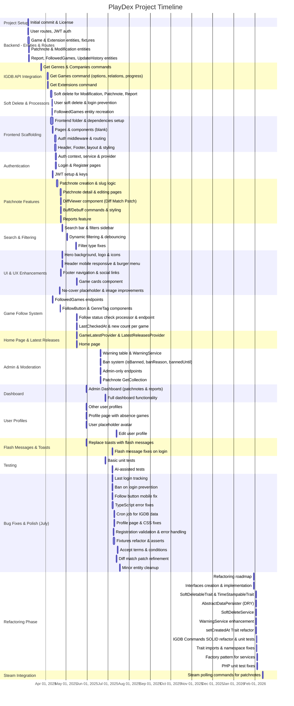

```mermaid
gantt
    title PlayDex Project Timeline
    dateFormat YYYY-MM-DD
    axisFormat %b %d, %Y

    section Project Setup
    Initial commit & License                         :2025-03-06, 1d

    section Backend - Entities & Routes
    User routes, JWT auth                            :2025-03-06, 1d
    Game & Extension entities, fixtures              :2025-03-06, 2d
    Patchnote & Modification entities                :2025-03-07, 1d
    Report, FollowedGames, UpdateHistory entities    :2025-03-07, 1d

    section IGDB API Integration
    Get Genres & Companies commands                  :2025-03-25, 1d
    Get Games command (options, relations, progress) :2025-04-03, 2d
    Get Extensions command                           :2025-04-04, 1d

    section Soft Delete & Processors
    Soft delete for Modification, Patchnote, Report  :2025-04-08, 2d
    User soft delete & login prevention              :2025-04-10, 1d
    FollowedGames entity recreation                  :2025-04-10, 1d

    section Frontend Scaffolding
    Frontend folder & dependencies setup             :2025-04-08, 4d
    Pages & components (blank)                       :2025-04-11, 1d
    Auth middleware & routing                        :2025-04-14, 2d
    Header, Footer, layout & styling                 :2025-04-14, 2d

    section Authentication
    Auth context, service & provider                 :2025-04-15, 2d
    Login & Register pages                           :2025-04-15, 2d
    JWT setup & keys                                 :2025-04-11, 1d

    section Patchnote Features
    Patchnote creation & slug logic                  :2025-04-17, 2d
    Patchnote detail & editing pages                 :2025-04-22, 2d
    DiffViewer component (Diff Match Patch)          :2025-04-23, 1d
    Buff/Debuff commands & styling                   :2025-04-23, 1d
    Reports feature                                  :2025-04-23, 1d

    section Search & Filtering
    Search bar & filters sidebar                     :2025-04-25, 1d
    Dynamic filtering & debouncing                   :2025-05-02, 1d
    Filter type fixes                                :2025-05-15, 1d

    section UI & UX Enhancements
    Hero background, logo & icons                    :2025-04-25, 1d
    Header mobile responsive & burger menu           :2025-04-25, 1d
    Footer navigation & social links                 :2025-04-23, 1d
    Game cards component                             :2025-05-16, 1d
    No-cover placeholder & image improvements        :2025-04-21, 1d

    section Game Follow System
    FollowedGames endpoints                          :2025-04-11, 1d
    FollowButton & GenreTag components               :2025-04-22, 1d
    Follow status check processor & endpoint         :2025-05-16, 1d
    LastCheckedAt & new count per game               :2025-05-16, 1d

    section Home Page & Latest Releases
    GameLatestProvider & LatestReleasesProvider       :2025-05-16, 1d
    Home page: followed & new games display          :2025-05-16, 1d

    section Admin & Moderation
    Warning table & WarningService                   :2025-06-20, 1d
    Ban system (isBanned, banReason, bannedUntil)    :2025-06-20, 1d
    Admin-only endpoints                             :2025-06-20, 1d
    Patchnote GetCollection                          :2025-06-20, 1d

    section Dashboard
    Admin Dashboard (patchnotes & reports)           :2025-05-30, 1d
    Full dashboard functionality                     :2025-06-27, 1d

    section User Profiles
    Other user profiles                              :2025-05-30, 1d
    Profile page with absence games                  :2025-05-30, 1d
    User placeholder avatar                          :2025-05-30, 1d
    Edit user profile                                :2025-07-13, 1d

    section Flash Messages & Toasts
    Replace toasts with flash messages               :2025-05-30, 1d
    Flash message fixes on login                     :2025-07-07, 1d

    section Testing
    Basic unit tests                                 :2025-06-27, 1d
    AI-assisted tests                                :2025-07-07, 1d

    section Bug Fixes & Polish (July)
    Last login tracking                              :2025-07-07, 1d
    Ban on login prevention                          :2025-07-07, 1d
    Follow button mobile fix                         :2025-07-07, 1d
    TypeScript error fixes                           :2025-07-07, 2d
    Cron job for IGDB data                           :2025-07-10, 1d
    Profile page & CSS fixes                         :2025-07-10, 1d
    Registration validation & error handling         :2025-07-09, 1d
    Fixtures refactor & asserts                      :2025-07-09, 2d
    Accept terms & conditions                        :2025-07-15, 1d
    Diff match patch refinement                      :2025-07-13, 1d
    Minor entity cleanup                             :2025-07-18, 1d

    section Refactoring Phase
    Refactoring roadmap                              :2026-01-30, 1d
    Interfaces creation & implementation             :2026-01-30, 1d
    SoftDeletableTrait & TimeStampableTrait          :2026-02-02, 1d
    AbstractDataPersister (DRY)                      :2026-02-02, 1d
    SoftDeleteService                                :2026-02-02, 1d
    WarningService enhancement                       :2026-02-02, 1d
    setCreatedAt Trait refactor                      :2026-02-02, 1d
    IGDB Commands SOLID refactor & unit tests        :2026-02-03, 1d
    Trait imports & namespace fixes                  :2026-02-03, 1d
    Factory pattern for services                     :2026-02-04, 1d
    PHP unit test fixes                              :2026-02-04, 1d

    section Steam Integration
    Steam polling commands for patchnotes            :2026-02-12, 1d
```
